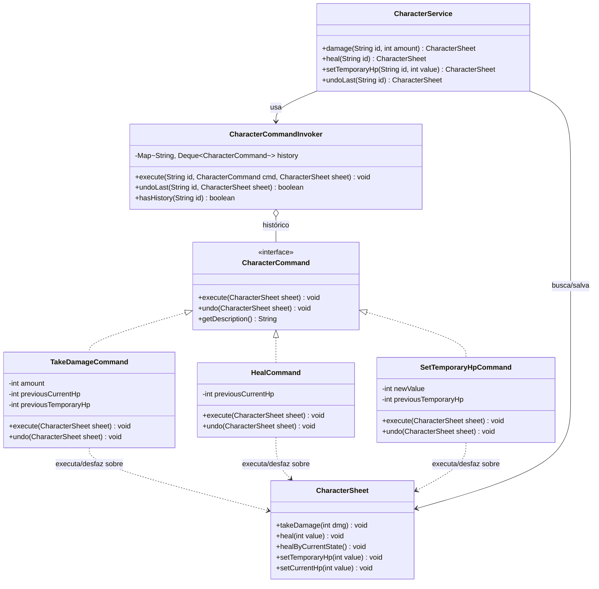
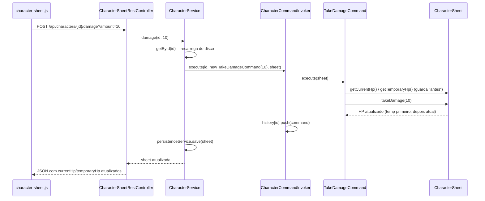

# Padrão Command — Ações de Combate da Ficha

Este documento explica como o padrão **Command** foi aplicado no projeto para
implementar as ações de **tomar dano**, **curar** e **ajustar HP temporário**
da ficha de personagem.

---

## 1. Problema que o padrão resolve

Antes desta implementação, o `CharacterEffectsController` decidia o que fazer
através de um `switch` sobre uma string de ação, e o método
`CharacterSheet.takeDamage()` — que já continha a regra de negócio "desconta
primeiro do HP temporário, depois do HP atual" — **não era chamado por
nenhum controller**. Não havia como desfazer uma ação, nem um jeito uniforme
de tratar "dano", "cura" e "ajuste de HP temporário" como o mesmo tipo de
coisa: uma **ação de combate**.

O Command resolve isso transformando cada ação em um **objeto**, ao invés de
uma chamada de método direta. Isso permite:

- Desacoplar quem **pede** a ação (o controller REST) de quem **sabe
  executá-la** (a própria `CharacterSheet` e suas regras);
- Guardar um **histórico** de ações executadas por personagem;
- **Desfazer** (undo) a última ação de combate aplicada.

---

## 2. Estrutura implementada

Todas as classes ficam no pacote `command/`:

```
command/
├── CharacterCommand.java          (interface do Command)
├── TakeDamageCommand.java         (comando concreto: dano)
├── HealCommand.java                (comando concreto: cura por State)
├── SetTemporaryHpCommand.java     (comando concreto: HP temporário)
└── CharacterCommandInvoker.java   (invoker: executa e guarda histórico)
```

### Papéis do padrão no projeto

| Papel clássico do GoF | Classe no projeto                              |
|------------------------|-------------------------------------------------|
| `Command` (interface)  | `CharacterCommand`                              |
| `ConcreteCommand`      | `TakeDamageCommand`, `HealCommand`, `SetTemporaryHpCommand` |
| `Receiver`             | `CharacterSheet` (quem realmente sabe *como* aplicar dano/cura) |
| `Invoker`              | `CharacterCommandInvoker`                       |
| `Client`               | `CharacterService`, que monta o comando e manda o invoker executá-lo |

### Diagrama de classes



---

## 3. Decisão de design: o comando não guarda a ficha

Uma particularidade importante deste projeto: a `CharacterSheet` é
**recarregada do disco a cada requisição** (`CharacterPersistenceService`
lê o JSON e devolve uma instância nova toda vez). Isso significa que, se um
comando guardasse a referência da ficha internamente (como no Command "de
livro-texto"), o `undo()` chamado numa requisição HTTP *posterior* estaria
atuando sobre um objeto desatualizado — e a ficha "de verdade" (recarregada)
não sentiria o efeito.

Por isso, a interface foi desenhada assim:

```java
public interface CharacterCommand {
    void execute(CharacterSheet sheet);
    void undo(CharacterSheet sheet);
    String getDescription();
}
```

A ficha (`Receiver`) é **passada como parâmetro** em vez de guardada no
construtor. O comando guarda apenas os **dados necessários para desfazer**
(ex.: o HP anterior), nunca a instância da ficha em si.

---

## 4. Exemplo: `TakeDamageCommand`

```java
public class TakeDamageCommand implements CharacterCommand {

    private final int amount;
    private int previousCurrentHp;
    private int previousTemporaryHp;

    public TakeDamageCommand(int amount) {
        this.amount = Math.max(0, amount);
    }

    @Override
    public void execute(CharacterSheet sheet) {
        previousCurrentHp = sheet.getCurrentHp();
        previousTemporaryHp = sheet.getTemporaryHp();

        // Regra "desconta do temporário antes do atual" já existia aqui:
        sheet.takeDamage(amount);
    }

    @Override
    public void undo(CharacterSheet sheet) {
        sheet.setTemporaryHp(previousTemporaryHp);
        sheet.setCurrentHp(previousCurrentHp);
    }

    @Override
    public String getDescription() {
        return "Sofreu " + amount + " de dano";
    }
}
```

O comando **não reimplementa** a regra de negócio — ele só encapsula a
*chamada* a `sheet.takeDamage(amount)`, que já existia no modelo, e guarda o
"antes" (`previousCurrentHp`, `previousTemporaryHp`) para poder reverter
depois.

`HealCommand` e `SetTemporaryHpCommand` seguem exatamente o mesmo formato:
guardam o estado anterior em `execute()` e o restauram em `undo()`.

---

## 5. O Invoker: histórico por personagem

```java
@Component
public class CharacterCommandInvoker {

    private final Map<String, Deque<CharacterCommand>> history =
            new ConcurrentHashMap<>();

    public void execute(String characterId, CharacterCommand command, CharacterSheet sheet) {
        command.execute(sheet);
        history.computeIfAbsent(characterId, id -> new ArrayDeque<>())
               .push(command);
    }

    public boolean undoLast(String characterId, CharacterSheet sheet) {
        Deque<CharacterCommand> stack = history.get(characterId);

        if (stack == null || stack.isEmpty()) {
            return false;
        }

        stack.pop().undo(sheet);
        return true;
    }
}
```

- É um `@Component` **singleton** do Spring — o histórico é um detalhe de
  aplicação (fica em memória) e **não é salvo no JSON** da ficha.
- A chave do mapa é o **id do personagem**, então cada ficha tem sua própria
  pilha de comandos.
- `execute()` roda o comando e empilha (`push`) na pilha daquele personagem.
- `undoLast()` desempilha (`pop`) o último comando e chama `undo()` nele.

Isso é uma pilha clássica de undo (`Deque` usado como stack, LIFO): a última
ação executada é a primeira a ser desfeita.

---

## 6. Fluxo completo (dano)



E o fluxo de desfazer é o espelho disso: `POST /{id}/undo` → `CharacterService.undoLast(id)`
→ `invoker.undoLast(id, sheet)` → desempilha o último `CharacterCommand` e
chama `undo(sheet)`.

---

## 7. Onde cada peça é usada

| Camada | Arquivo | O que faz |
|---|---|---|
| View (HTML) | `templates/character/view.html` | Painel "Ações de Combate" ao lado da ficha: campo de HP temporário, campo + botão de dano, botão de desfazer |
| JS | `static/js/character-sheet.js` | `applyDamage()` e `undoLast()` chamam os endpoints REST via `fetch` |
| REST | `controller/CharacterSheetRestController.java` | `POST /api/characters/{id}/damage`, `POST /api/characters/{id}/undo`, `POST /api/characters/{id}/heal` |
| Service (Client do Command) | `service/CharacterService.java` | Monta o `ConcreteCommand` certo e pede ao invoker para executá-lo |
| Invoker | `command/CharacterCommandInvoker.java` | Executa e guarda o histórico |
| ConcreteCommands | `command/TakeDamageCommand.java`, `HealCommand.java`, `SetTemporaryHpCommand.java` | Encapsulam cada ação e sabem desfazê-la |
| Receiver | `model/character/CharacterSheet.java` | Contém a regra de negócio de verdade (ex.: `takeDamage` já descontava do HP temporário antes do atual) |

---

## 8. Por que isso é Command e não apenas "métodos de serviço"

A diferença chave é que a **ação virou um objeto com estado próprio**
(`amount`, `previousCurrentHp`, etc.), guardado numa estrutura externa
(o invoker), e não apenas uma chamada de método que termina e é esquecida.
Isso é o que viabiliza:

1. **Undo real**, sem precisar recalcular "o que era antes" — o próprio
   comando já sabe, porque capturou o estado no momento da execução;
2. **Histórico por personagem** guardado fora da ficha (não polui o
   modelo/JSON com dados de "auditoria" de sessão);
3. Extensibilidade: uma nova ação de combate (ex.: "aplicar veneno",
   "long rest") só precisa de uma nova classe `implements CharacterCommand`,
   sem tocar no invoker nem nos comandos existentes.